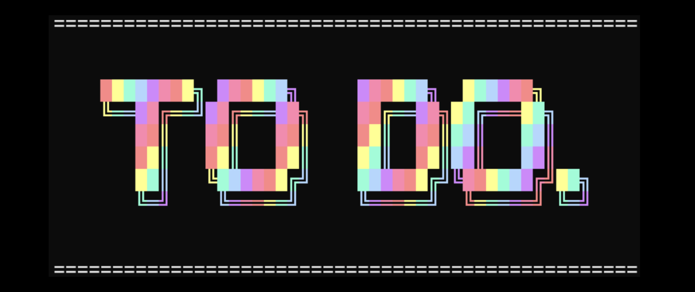

👋 TO DO. is a fun, secure, and easy-to-use task management app that runs directly in your terminal.
Unlike typical plain-text CLI tools, TO DO. brings your productivity to life with emoji, colour, and ASCII art banners — making task management engaging and stress-free.

In today’s world of productivity apps, many solutions are either overly complex (e.g., Notion, Trello) or too minimal (simple text files or todo.txt). TO DO. addresses this gap by providing:

- ✅ A lightweight and accessible tool you can use directly in the terminal.

- ✅ A secure environment with hashed passwords and JSON-based storage.

- ✅ An engaging user experience, so managing your tasks doesn’t feel like a chore.
<hr>

Command line tools are still one of the fastest ways to get work done, especially for developers. They use minimal resources and fit right into existing workflows [1]. At the same time, studies show that good design, like clear visuals and easy-to-use interfaces  keeps people coming back to an app [2].

TO DO. adds colour, ASCII banners, and emojis to make managing tasks in the terminal more fun and engaging.

## Features

- 🌈 Colourful CLI - emoji and ASCII art for an engaging experience.

- 🔒 Secure login system - user data stored in JSON, passwords hashed with bcrypt.

- 👤 Guest mode - try before signing up (tasks aren’t saved in guest mode).

- 📝 Task management - add, view, mark as complete, and delete tasks.

- 🔝 Prioritisation - organise tasks with High, Medium, or Low priority levels.

- 💾 Persistent storage - your tasks are saved and ready when you return.

## Docs & Help Files

For more detailed information, click the ```docs``` folder:

- ⚙️ ```Dependencies.md``` – The libraries and packages TO DO. needs to operate, it's purpose and an outline of the legal and ethical impacts.

- 💻 ```Installation.md``` – Step-by-step guide to get TO DO. running on your system.

- 📋 ```Requirements.md``` – Hardware and system requirments.

- 📝 ```Usage.md``` – Detailed instructions for using all features of TO DO.

These help files make it easy to set up, use, and troubleshoot the app — everything you need in one place!

## Target Market & User Stories
Perfect for students, developers, and anyone who loves organising their day without leaving the terminal.

- 🎓 Students who need a simple but reliable task manager.<br>
*“As a student, I want to organise assignments by priority so I don’t miss deadlines.”*

- 👨‍💻 Developers who work in the terminal and want a non-boring alternative to plain task apps.<br>
*“As a developer, I want to manage tasks without leaving my terminal workflow.”*

- ⚡ Productivity enthusiasts looking for a lightweight tool without syncing to external services.<br>
*"As a user who is productively organised, I want a lightweight tool that keeps me organised without syncing to external services."*

- 👀 Casual users who want to “try before they commit” with guest mode. <br>
*“As a new user, I want to try an app in guest mode before creating an account.”*

## Security & Data Storage

TO DO. takes your privacy and data seriously. Whether you’re managing assignments, work tasks, or personal projects, you can trust that your information is safe:

- 💻 Secure login system – Passwords are hashed using bcrypt, ensuring they’re never stored in plain text.

- 💾 Local storage – All task data is stored in JSON files on your machine, giving you full control without relying on external servers.

- 🕵️‍♂️ Guest mode – Try the app without creating an account. Tasks created in guest mode aren’t saved, protecting your privacy.

- 💾 Data persistence – Tasks you create are saved locally, so you can return to your to-do list exactly as you left it.

- 🚫 No external tracking or cloud syncing – Your data stays on your machine unless you choose to back it up yourself.

## Similar Projects & Inspiration

- 💡 [Todo.txt CLI](http://todotxt.org/) – A minimalist task manager in plain text.

- 💡 [Taskwarrior](https://taskwarrior.org/) – A powerful CLI task manager, but with a steep learning curve.

TO DO. draws inspiration from these projects but focuses on fun, ease of use, and accessibility while still keeping your data safe.

## References
[1] Arjun K. (2024) *Why Command-Line Tools Are Still Relevant in the Age of GUIs*, https://dev.to/arjun98k/why-command-line-tools-are-still-relevant-in-the-age-of-guis-3n7m?utm_, accessed 3 October 2025.

[2] Stutcliffe, A. G. (2023) *Why people choose apps: Aesthetics, usability, and engaging interaction*, https://www.sciencedirect.com/science/article/pii/S1071581922001835?utm_, accessed 3 October 2025.