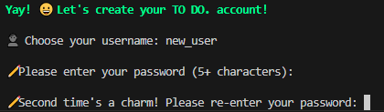
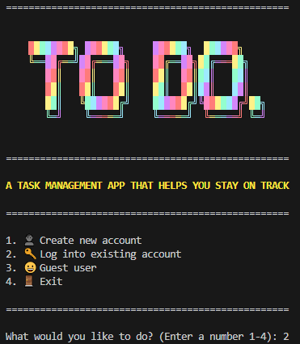
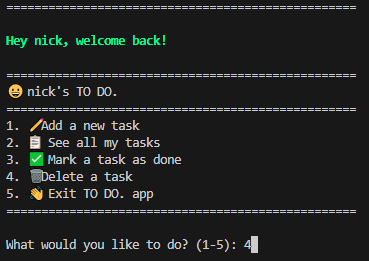

# How To Use
1. Ensure your system meets requirements in `Requirements.md`
2. Perform installation steps in `Installation.md`
3. Launch the app

## Table of Contents
- [Create New User](#create-new-user)
- [Login](#login)
- [Login As Guest](#login-as-guest)
- [Create A Task](#create-a-task)
- [See All Tasks](#see-all-tasks)
- [Mark Task Complete](#mark-task-complete)
- [Delete A Task](#delete-a-task)
- [Exit App](#exit-app)

### Create New User
Create a new username to save tasks between sessions.

1. From the main menu of the app, choose option '1: Create new account' by typing `1` then pressing Enter 

2. Type your chosen username, then press Enter  

    * If your username is already taken, you'll be notified and asked to choose a different username  
    
3. Type your chosen password, then press Enter. If password is accepted, type it again to confirm  

4. Once your password is confirmed, you will see the task menu. You've succesfully created a user!  

### Login
Login to a previously created user account.
1. From the main menu of the app, choose option '2: Log into existing account' by typing `2` then pressing Enter  

2. Type your username, then press Enter  

    * If username & password is not recognised, you'll be notified and asked to try again  
    
3. Type your password, then press Enter. You've now logged in and will see the task menu!  

### Login As Guest
Skip login and use app as Guest user. You won't be able to save your tasks as a guest!  
1. From the main menu of the app, choose option '3: Guest user' by typing `3` then pressing Enter  

2. You will now be logged in as a Guest and will see the task menu  

### Create A Task
Once logged in as a user or guest, create a new task to track in your to do list.
1. From the tasks menu, choose option '1: Add a new task' by typing `1` then pressing Enter  

2. Indicate if the task is important when prompted by entering `y` or `n` then pressing Enter

    * If you entered `y`, indicate task important when prompted with a number `1`-`3` and pressing Enter  
    
3. You have now entered your task! An aknowledgment will be displayed, and you'll return to the tasks menu  

### See All Tasks
To view all tasks on your to do list.
1. From the tasks menu, choose option '2: See all my tasks' by typing `2` then pressing Enter  

2. You will see a list of all your tasks, including their importance and completion status  

### Mark Task Complete
Once your task is finished, mark it as complete with this option.
1. From the tasks menu, choose option '3: Mark a task as done' by typing `3` then pressing Enter  

2. From the list of tasks, enter the task number you want to mark as done, then press Enter  

3. Your task will now be updated! You'll return to the task menu, and see an updated tasks list  

### Delete A Task
Remove a task from your list.
1. From the tasks menu, choose option '4: Delete a task' by typing `4` then pressing Enter  

2. Using the task number in the displayed list, choose the task to delete, then press Enter  

3. Your task is now deleted You''ll return to the task menu, and see an updated tasks list  

### Exit App
Safely exit the program.
1. From either the main menu, or the tasks menu, enter the final option number (`4` or `5`), then press Enter  

2. You have now exited the app. Hope to see you again soon!  

